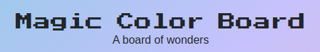

# Magic Color Board

A web application and library for controlling RGB LED matrices with a raspberry pi

Inspired by the Tidbyt kickstarter

## Setup

This is meant to be built on a Raspberry Pi. Currently the only RPi tested has been a 3B+.

Because the code is meant to be ran on a RPi and should utilize the IO pins, special code needs to be downloaded and built on the pi. It is important to know that the developers of this project utilized the following items to make the board:

- Raspberry Pi 3B+
- [Adafruit RGB Matrix HAT](https://www.adafruit.com/product/2345)
- 5V power supply
- [64x32 RGB LED Matrix, P3](https://www.amazon.com/gp/product/B079JSKF21/ref=ppx_yo_dt_b_search_asin_title?ie=UTF8&psc=1)

The use of the HAT improves setup time and is recommended as it creates a cleaner build. You can manually wire each of the respective wires from the ribbon and it should produce the same results if wired correctly. We recommend that you test the functionality of your wiring on a known library before attempting to use this application.

Adafruit published a nice [guide](https://learn.adafruit.com/adafruit-rgb-matrix-plus-real-time-clock-hat-for-raspberry-pi) on how to wire the matrix and then properly configure the RPi with the necessary library. This application leverages their setup file which also leverages the well made [rpi-rgb-led-matrix library by hzeller](https://github.com/hzeller/rpi-rgb-led-matrix).

### Docker - Compose

This two applications that comprise the entire Magic Color Board system have been dockerized for ease of testing/deployment. The quickest way to run the application right away is to first [install docker and docker-compose on your RPI](https://dev.to/rohansawant/installing-docker-and-docker-compose-on-the-raspberry-pi-in-5-simple-steps-3mgl) and then run

`docker-compose up` or `docker-compose up --build`

from the root of the respository. This should build both the `app` and `api` docker containers and run them simultaneously. **This will take a while to complete the first time you run this on a RPi and possibly when you rebuild an image**. `Ctrl-C` can be used to stop the containers from that point. [See this guide for more ways to use `docker-compose`](https://gabrieltanner.org/blog/docker-compose).

### Docker - Individual Containers

Both the `app` and `api` directories have their own `Dockerfile` which allows them to be built and ran separately if needed. **This also opens up the possibility to host the webapp on a separate device for development purposes**. Here some examples of how to build and run each container:

- API

`docker build -t magic-color-board-api .`
`docker run --privileged -p 5000:5000 -d magic-color-board-api`

- App

`docker build -t magic-color-board-app .`
`docker run -p 3000:3000 -d magic-color-board-app`

### Last Resort

You can install the necessary packages and items on your RPI/device to run `app` and `api` manually. The setup files needed for this should all be in the [`setup.sh`](setup.sh) file.

## Structure

### App

The webapp is a React app built on the Next.js framework. React was chosen as it was the state-of-the-art at the time when it came to webapp devleopment. This provides ease of adding and removing components at will to the board which may prove useful and different Magic Color Board applications are developed. The app is then hosted via Next.js's own server system built in. A user could run `npm run dev` or `npm run build` `npm run start` to start the application directly from the [`app`](app/) directory.

### API

The API was built simply from Flask. While this may not be the most robust for any serious applications, it provides a python basis for the API which allow for easy integration into the LED driver library. Also, the original author has a bit of experience in Python and Flask, so you are gonna have to deal with it for now...The app can be run with the command `sudo ./main.py` from the [`api`](api/) provided one has installed all the necessary dependencies.

## Future

This project is currently in its infancy at time of writing. There is minimal functionality. The dream will be a full configurable and customizable LED matrix application that can be used in a variety of cases and allow any user to develop their own application.
